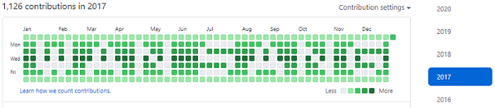

# Let's Planting grass on Github

1일 1커밋보다 원하는 기능을 마음껏 만들 수 있는 개발자가 꿈입니다.

제 이름을 잔디로 심어봤습니다.

## README -> [한국어](./doc/README_kr.md) | [How do I design(kr)](./doc/How_do_I_design.md)

- 2020-12-29 ~ 2020-12-30

## Isn't green grass important on Github? `I can say 'No'`

Why? The answer link -> [StackExchange](https://softwareengineering.stackexchange.com/questions/345679/is-daily-commit-and-push-necessary-for-managers-and-supervisors-to-check-my-prog#:~:text=It%20should%20not%20be%20necessary,not%20very%20good%20at%20management.)
