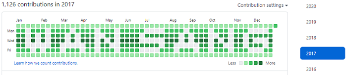

# 깃허브에 잔디를 심어보자

### README -> [English](../README.md) | [How do I design(kr)](./How_do_I_design.md)

- 2020-12-29 ~ 2020-12-30

## 결과

## 왜 이 프로젝트를 진행했는가?

### **첫 번째 이유: 동빈나님의 유튜브([링크](https://www.youtube.com/watch?v=9NAQjH7kcNk))를 보고 영감을 얻음**

1일 1커밋의 취지는 좋으나 저처럼 스트레스 받는 사람들의 스트레스를 없에기 위해 시작한 프로젝트입니다.

커밋을 꾸준히 하는 것도 좋지만 자신의 환경에 맞게 공부하는 것이 중요하다고 생각했습니다.

### **두 번째 이유: 깃을 쉽게 조작하고 파이썬과 쉘 스크립트를 잘 다뤄보고 싶었음**

### **세 번째 이유: 2018년에 다른사람의 pull request를 올린 것을 삭제하지 못해 숨기고 싶어서**

## 어떻게 설계했는가?

### [설계 과정](./How_do_I_design.md)
