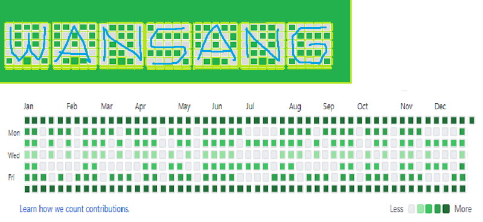
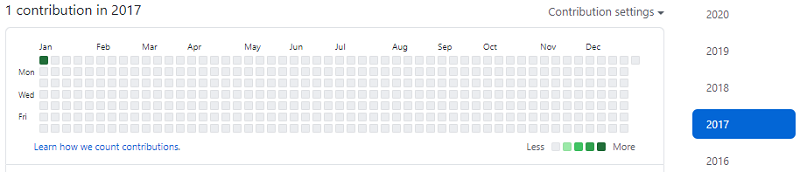
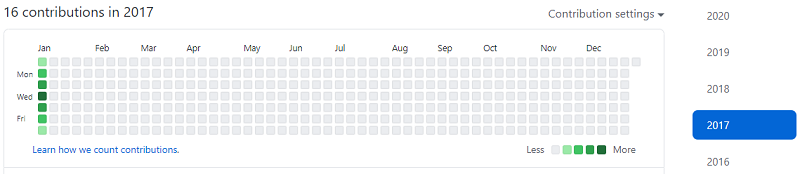

# Let's Planting grass on Github

# 잔디를 심어서 나의 이름을 남겨보자!

- 2020-12-29 ~ 2020-12-30

## :zero: Abstract

의식의 흐름대로 정리한 노트ㅋㅋ 나중에 수정해야지!

Update soon(Soon sometimes means in 20 years)

## :one: Design

1. Goal
   
   - Farming in 2017: 2017년은 1월 1일이 일요일부터 시작이라 깔끔합니다.
   - work hard with mspaint
      
     **BLUEPRINT**

     

     Search at Google, link -> [5x5 text font alphabet](https://www.google.com/search?q=5x5+text+font+alphabet&newwindow=1&source=lnmstbm=isch&sa=X&ved=2ahUKEwiz4NfvtfLtAhWFNaYKHVHvDmcQ_AUoAXoECBEQAw&biw=1536&bih=754), [green kind of name](https://www.google.com/search?q=green+kind+of+name&tbm=isch&ved=2ahUKEwjez9LTwfLtAhXvGKYKHZy-AtAQ2-cCegQIABAA&oq=green+kind+of+name&gs_lcp=CgNpbWcQAzoCCAA6CAgAELEDEIMBOgcIABCxAxBDOgQIABBDOgUIABCxAzoECAAQHjoGCAAQBRAeOgYIABAIEB5Q2BtYzDxg5j1oAHAAeACAAWyIAdEOkgEEMTAuOZgBAKABAaoBC2d3cy13aXotaW1nsAEAwAEB&sclient=img&ei=6sXqX96yG--xmAWc_YqADQ&bih=754&biw=1536#imgrc=VdfLP1YaRGmNmM)


     ```python
     11111111111111111111111111111111111111111111111111111  # 53
     2202220222202222022202222200002222022220222022200002  # 36 * 3
     3303030333030333003303333033333330303330033033033333  # 37 * 5
     4404040444040444040404444000004440404440404044040004  # 30 * 7
     3300000330000033033003333333303300000330330033033303  # 28 * 5
     2220202220222022022202222000022202220220222022200022  # 35 * 3
     1111111111111111111111111111111111111111111111111111  # 52 * 1
     ```
     
     **Total**: 853 Commits

     try like this -> one first commit + colour a few commit + remainder using for loop
   
     ~~1. Count the commits how many I need~~

     - ~~1st line(Sun): 53 * 1(lime colour) = 53~~
     - ~~2ed(Mon): 17 + 3(W)+4(A)+3(N)+1(S)+4(A)+3(N)+1(G) = 17 + 19 = 36 -> 36 * 3(Pear colour) = 108~~
     - ~~3th(Tue): 17 + 2(W)+3(A)+2(N)+4(S)+3(A)+2(N)+4(G) = 17 + 20 = 37 -> 37 * 5(Emerlad colour) = 185~~
     - ~~4th(Wed): 17 + 2(W)+3(A)+2(N)+0(S)+3(A)+2(N)+1(G) = 17 + 13 = 30 -> 30 * 7(Seaweed colour) = 210~~
     - ~~5th(Thr): 17 + 0(W)+0(A)+2(N)+4(S)+0(A)+2(N)+3(G) = 17 + 11 = 28 -> 28 * 5 = 140~~
     - ~~6th(Fri): 17 + 3(W)+3(A)+3(N)+1(S)+3(A)+3(N)+2(G) = 17 + 18 = 35 -> 35 * 3 = 105~~
     - ~~7th(Sat): 52 * 1 = 52~~

      ~~총 커밋을 세는 방법(with Python)~~(설계도 그려서 다시 셈)

      ```python
      #  default seeds on oneline: 1(first line) + 2(letter-spacing)*8(letters(7) & space(1)) = 17
      #  example) 2ed line
      #  1101110111101111011101111100001111011110111011100001 =
      #  (1+3(W)+1) + (1+4(A)+1) + (1+3(N)+1) + 2 + (1+1(S)+1) + ... =
      #  17 + 3(W)+4(A)+3(N)+1(S)+4(A)+3(N)+1(G) = 17 + 19 = 36
      sum([53, 36*3, 37*5, 30*7, 28*5, 35*3, 52])  # 853
      sum(int(i) for i in range('1101110111101111011101111100001111011110111011100001'))  # 17
      '2202220222202222022202222200002222022220222022200002'.count('2')  # 36
      ```
## :two: Forge Commit with Linux Shell

   커밋을 조작하기 위해 저는 리눅스 셸 스크립트로 할 예정입니다.

   사실 깃배쉬에서 가능할 수도 있지만 셸 스크립트를 지원이 원할하지 못할꺼 같아 편한 리눅스 환경에서 하려 합니다.

   ~~저의 OS는 Windows이기 때문에 Linux Bash Shell을 다운로드를 해야 합니다.~~

   - 리눅스 배쉬 쉘 윈도우에서 사용하는법 링크(한글) -> [https://harryp.tistory.com/730](https://harryp.tistory.com/730)
   - How to install Linux Bash Shell on Windows 10 Link(english) -> [https://www.howtogeek.com/249966/how-to-install-and-use-the-linux-bash-shell-on-windows-10/](https://www.howtogeek.com/249966/how-to-install-and-use-the-linux-bash-shell-on-windows-10/)

   ~~귀찮아서 가상머신에서 돌렸습니다.~~

## :three: Test (흐름대로 정리하기)

- 순서도
   1. Git commit 을 몇개 올린다.
   2. 올린 커밋의 날짜를 수정한다.
      - 수정 순서: ~~가장 오래된 커밋부터 가장 늦은 날(1/1)로 옮기기~~
      - 이유: ~~세로로 진행하는 이유는 깃 커밋 순서가 꼬이면 에러가 발생할 것 같다.~~ (상관 없음)
      - 1/1(1개) -> 1/2(2개) -> 1/3(3개) -> 1/4(4개) -> 1/5(3개) -> 1/6(2개) -> 1/7(1개)
   3. 잘 적용되는지 확인한다.
   4. 위의 1~2 단계를 반복문으로 작성한다.
      반복문 논리
      - ~~TAIL로 마지막 커밋을 불러서 날짜를 2017년 1월 1일부터 쭉 커밋을 시켜본다.~~
      - ~~커밋을 세로로(날짜 순으로) 진행한다.~~ -> 크게 필요x
      - ~~Tail 문이 rebase 에 있는지 확인부터ㅜㅜ다른 방법을 찾아보자~~
   5. 반복해서 잔디를 이쁘게 심는다.

1. 커밋 하나 수정해보기

   

   ```bash
   $ git rebase -i <해당 커밋>
   $ git commit --amend --no-edit --date "JAN 1 12:00 2017 +0900"
   $ git rebase --continue
   ```

2. 반복문 안에 로직 만들기

   ```bash
   vi 1.txt
   i
   1
   # esc키 -> 이부분을 어떻게 할 것 인가?
   :wq
   git add .
   git commit -m "1"
   git commit --amend --no-edit --date "JAN 4 12:0:00 2017 +0000"  # 날짜 부분을 변수로 설정하여 넣기

   ```
   [해결 링크](https://stackoverflow.com/questions/17637591/how-to-detect-when-user-press-esc-and-do-something-in-shell-script/17640588)

3. 색깔 넣어보기

   반복문 안에 로직을 두차두차해서

   


4. 파이썬으로 로직을 짜보기

   [파이썬으로 짜본 코드](./test.py)

   ```python
   blueprint = '12343211234321100002112340011200021123400110000211234321123432112340011200021103402112000211234001123432112343211000001120432112303211234021100000112343211234321123432112343211200301103030110303011030301103002112343211234321123400112000211034021120002112340011234321123432110000011204321123032112340211000001123432112343211200021103430110303011030301103002112343211'
   Month_name = ['JAN', 'FEB', 'MAR', 'APR', 'MAY', 'JUN', 'JUL', 'AUG', 'SEP', 'OCT', 'NOV', 'DEC']
   Month_count = [31, 28, 31, 30, 31, 30, 31, 31, 30, 31, 30, 31]
   month = 0
   day = 0

   # 값 추출하기 알고리즘: JAN 1 JAN 2 JAN 2 JAN 3 ... DEC 29 DEC 29 DEC 30 DEC 31
   for i in blueprint:
      # 날짜 갱신
      day += 1
      # 날짜 정보 갱신
      over_count = int(Month_count[month])
      if over_count < day:
         day -= over_count
         month += 1

      # blueprint의 숫자를 보고 반복
      for j in range(int(i)):
         print(f'{Month_name[month]} {day}', end=' ')
         # TODO: 파일 수정 코드 추가
         # 깃 업데이트
         #    git add .
         #    git commit -m "Plant grass +1"
         #    git commit --amend --no-edit --date "${Month_name[month]} ${day} 12:0:00 2017 +0000"
   ```

5. 리눅스 로직짜기(반복문 없이 한개만 해보기)

   ```bash
   # .git가 있는 디렉토리에 들어가서
   touch macro.sh
   vi macro.sh
   ```

   ```sh
   # !/bin/bash
   git add .
   git commit -m "Farming Macro"
   git commit --amend --no-edit --date "JAN 1 12:0:00 2017 +0000"
   ```

   ```bash
   ./macro.sh
   ```

6. 파이썬으로 짠 코드를 셸로 바꾸기

   ```sh
   # !/bin/bash

   blueprint="1 2 3 4 3 2 1 1 2 3 4 3 2 1 1 0 0 0 0 2 1 1 2 3 4 0 0 1 1 2 0 0 0 2 1 1 2 3 4 0 0 1 1 0 0 0 0 2 1 1 2 3 4 3 2 1 1 2 3 4 3 2 1 1 2 3 4 0 0 1 1 2 0 0 0 2 1 1 0 3 4 0 2 1 1 2 0 0 0 2 1 1 2 3 4 0 0 1 1 2 3 4 3 2 1 1 2 3 4 3 2 1 1 0 0 0 0 0 1 1 2 0 4 3 2 1 1 2 3 0 3 2 1 1 2 3 4 0 2 1 1 0 0 0 0 0 1 1 2 3 4 3 2 1 1 2 3 4 3 2 1 1 2 3 4 3 2 1 1 2 3 4 3 2 1 1 2 0 0 3 0 1 1 0 3 0 3 0 1 1 0 3 0 3 0 1 1 0 3 0 3 0 1 1 0 3 0 0 2 1 1 2 3 4 3 2 1 1 2 3 4 3 2 1 1 2 3 4 0 0 1 1 2 0 0 0 2 1 1 0 3 4 0 2 1 1 2 0 0 0 2 1 1 2 3 4 0 0 1 1 2 3 4 3 2 1 1 2 3 4 3 2 1 1 0 0 0 0 0 1 1 2 0 4 3 2 1 1 2 3 0 3 2 1 1 2 3 4 0 2 1 1 0 0 0 0 0 1 1 2 3 4 3 2 1 1 2 3 4 3 2 1 1 2 0 0 0 2 1 1 0 3 4 3 0 1 1 0 3 0 3 0 1 1 0 3 0 3 0 1 1 0 3 0 0 2 1 1 2 3 4 3 2 1 1"

   Month_name=('JAN' 'FEB' 'MAR' 'APR' 'MAY' 'JUN' 'JUL' 'AUG' 'SEP' 'OCT' 'NOV' 'DEC')
   Month_count=('31' '28' '31' '30' '31' '30' '31' '31' '30' '31' '30' '31')
   month=0
   day=0
   count=1

   for i in $blueprint
   do
   # 날짜 갱신
   day=`expr $day + $count`
   # 날짜 정보 갱신
   over_count=${Month_count[$month]}
   if [ $over_count -lt $day ]
   then
      day=`expr $day - $over_count`
      month=`expr $month + $count`
   fi
   for j in $i
   do
      echo "$j ${Month_name[$month]}, $day"
      # git add .
      # git commit -m "Farming Macro"
      # git commit --amend --no-edit --date "${Month_name[$month]} $day 12:0:00 2017 +0000"
   done
   done
   ```

7. 파일 수정 매크로

   ```sh
   # !/bin/bash

   echo '1' >> 1.txt
   ```

8. 최종 매크로

## TODO

- ~~커밋 날짜 바꾸기 원리 이해하기, 링크~~ (완료) -> [https://ndb796.tistory.com/271](https://ndb796.tistory.com/271)
- ~~`git rebase` 옵션들 살펴보기~~ (다른 방법으로 하려함) -> `git help rebase`
- 리눅스 셸 스크립트 배우기(easily control file system & committing with Linux Bash)
  - [셸 배열 선언 링크](https://blog.leocat.kr/notes/2018/02/18/shell-declare-list)
  - [셸 숫자 연산하기 링크](https://**euless**.tistory.com/51)
